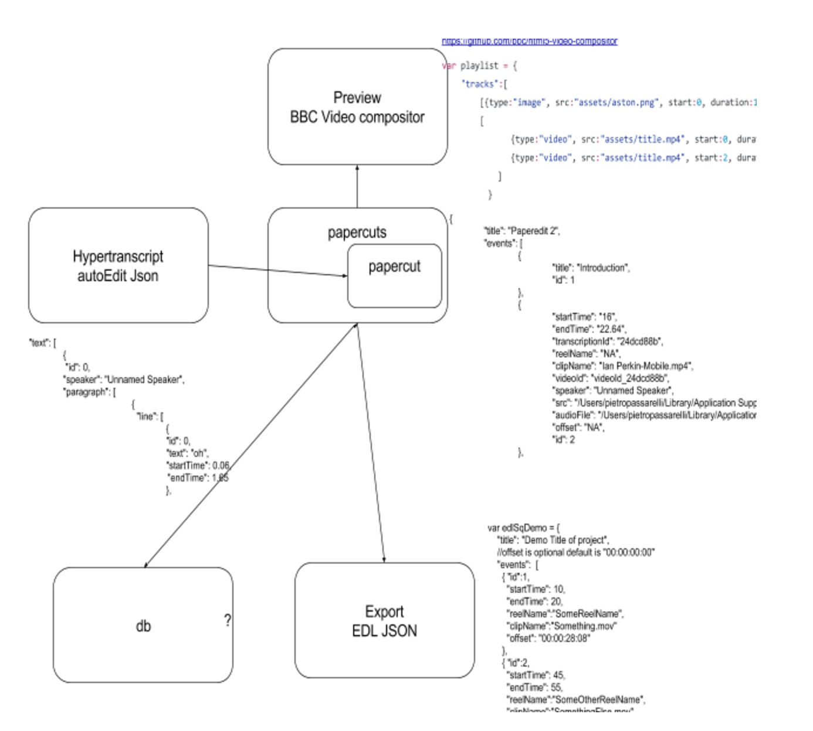

# video-preview

### Component/part description

### Related projects.

### Implementations Options considered

#### BBC Video context "EDL JSON"

BBC Video context previously video compositor.

[Preview/ BBC Video compositor](https://github.com/bbc/html5-video-compositor)

This is the sequence taken in by tge BBC video compositor to be able to render a video preview in canvas. It takes two tracks, but for our porpuses we can just pass one track. Needs adding type “video”, change startTime to start. And add duration instead of endTime.

```javascript
var playlist = {
"tracks":[
[{type:"image", src:"assets/aston.png", start:0, duration:10, id:"aston"}],
[{type:"video", src:"assets/title.mp4", start:0, duration:2, id:"title"},
{type:"video", src:"assets/title.mp4", start:2, duration:8, id:"clip1"}]
]
}
```

#### Popcorn js

#### Vanilla js

#### Two players

Various options see jsfiddle example. Overall popcornjs altho deprecated, was the smoothest one.

## Option: PopcornJS preview sequence.

Downside is that it creates canvas\(?\) and need to re-implement “video” controls for preview as well as progress bar etc.. becomes a very involved component.

It uses Canvas?

JSfiddle: [https://jsfiddle.net/pietrops/0adkfke9/](https://jsfiddle.net/pietrops/0adkfke9/) Not working, coz no popcorn js CDN but code is correct.

Documentation [https://github.com/mozilla/popcorn-docs/blob/gh-pages/modules/\_posts/2012-12-12-sequence.md](https://github.com/mozilla/popcorn-docs/blob/gh-pages/modules/_posts/2012-12-12-sequence.md)

## Option: HTML5 Video

JSfidde: [https://jsfiddle.net/pietrops/q9uwtdee/](https://jsfiddle.net/pietrops/q9uwtdee/) Description: a plain vanilla javascript that makes the most of the HTML5 Video element to play a sequence of video segments continuosly, where src, inp point and out point are specified. Notes: Needs refactoring to remove side effects from methods.

## → Option: HTML5 Video - media fragment

JSFiddle: [https://jsfiddle.net/pietrops/dyxpws41/](https://jsfiddle.net/pietrops/dyxpws41/) HTML5 Video Play sequence of video segments using format [http://solutions.brightcove.com/bcls/assets/videos/Bird\_Titmouse.mp4\#t=2,4](http://solutions.brightcove.com/bcls/assets/videos/Bird_Titmouse.mp4#t=2,4)

More on media fragments: [https://youtu.be/LfRRYp6mnu0](https://youtu.be/LfRRYp6mnu0)

[https://www.html5rocks.com/en/tutorials/video/basics/](https://www.html5rocks.com/en/tutorials/video/basics/)

Webm example for nwjs \(nwjs does not support mp4\)

var videoSequence = \[{"src": "[http://dl1.webmfiles.org/big-buck-bunny\_trailer.webm](http://dl1.webmfiles.org/big-buck-bunny_trailer.webm)", "inPoint":3.2 , "outPoint":6},{"src": "[http://dl1.webmfiles.org/elephants-dream.webm](http://dl1.webmfiles.org/elephants-dream.webm)", "inPoint": 1, "outPoint":3},{"src": "[http://dl1.webmfiles.org/big-buck-bunny\_trailer.webm](http://dl1.webmfiles.org/big-buck-bunny_trailer.webm)", "inPoint": 10, "outPoint":15}\] Issue: flicker white in between videos

[https://stackoverflow.com/questions/26670048/video-flicker-once-upon-change-of-source](https://stackoverflow.com/questions/26670048/video-flicker-once-upon-change-of-source)

[https://stackoverflow.com/questions/32843507/html5-play-movie-from-multiple-parts-without-flashing-screen](https://stackoverflow.com/questions/32843507/html5-play-movie-from-multiple-parts-without-flashing-screen)

Issue sometimes it says src undefined. I think I needs some if counter &lt; videosequence.kength

Improved version : [https://jsfiddle.net/pietrops/u5usa10f/](https://jsfiddle.net/pietrops/u5usa10f/) using setTimeout

Version with namespace [https://jsfiddle.net/pietrops/98b07h4m/](https://jsfiddle.net/pietrops/98b07h4m/)

→ Version with pause state object to resume from paused point within clip segment [https://jsfiddle.net/pietrops/kus10b48/](https://jsfiddle.net/pietrops/kus10b48/) Relies on adding vars to window object.

HML5 video API [https://www.w3.org/2010/05/video/mediaevents.html](https://www.w3.org/2010/05/video/mediaevents.html) Option: client side ffmpeg video concat [https://bgrins.github.io/videoconverter.js/](https://bgrins.github.io/videoconverter.js/)

## Option: moviemasher

It’s in angular tho [http://www.moviemasher.com/](http://www.moviemasher.com/) [http://www.moviemasher.com/demo/](http://www.moviemasher.com/demo/) [http://www.moviemasher.com/docs/](http://www.moviemasher.com/docs/)

## Option: BBC HTML5 Video compositor

[https://github.com/bbc/html5-video-compositor](https://github.com/bbc/html5-video-compositor)

[https://github.com/bbc/html5-video-compositor/wiki/Quick-Start-Guide](https://github.com/bbc/html5-video-compositor/wiki/Quick-Start-Guide)

[https://github.com/bbc/html5-video-compositor/wiki/Playlists](https://github.com/bbc/html5-video-compositor/wiki/Playlists)

EDL Json / playlist:

var playlist = { "tracks":\[ \[{type:"image", src:"assets/aston.png", start:0, duration:10, id:"aston"}\], \[{type:"video", src:"assets/title.mp4", start:0, duration:2, id:"title"},{type:"video", src:"assets/title.mp4", start:2, duration:8, id:"clip1"}\] \] }

Media source:

{ id:"title", //A unique ID used to identify the created MediaSource type:"video", //A type can be either 'canvas', 'video', or 'image' src:"assets/title.mp4", //A URL to load the media from, only works for 'image' and 'video' types. \(See Element vs Source below\) start:0, //The time at which to start playing the created MediaSource sourceStart: 10 //Only applicable to type 'video', the time from within the source file to start playing. duration:2 //How long to display the created MediaSource for. }

However this is now deprecated in favour of BBC video context.

## Option: BBC Video Context

[https://github.com/bbc/videocontext](https://github.com/bbc/videocontext)

Some more research has been done

[https://github.com/bbc/VideoContext/issues/42\#issuecomment-296155545](https://github.com/bbc/VideoContext/issues/42#issuecomment-296155545)

To try and add as script tag while figure out how to include in browserify. Add it in nwjs folder and reference from there. With just `/`

### Current implementation

Data structures in view components.



### What needs refactoring

