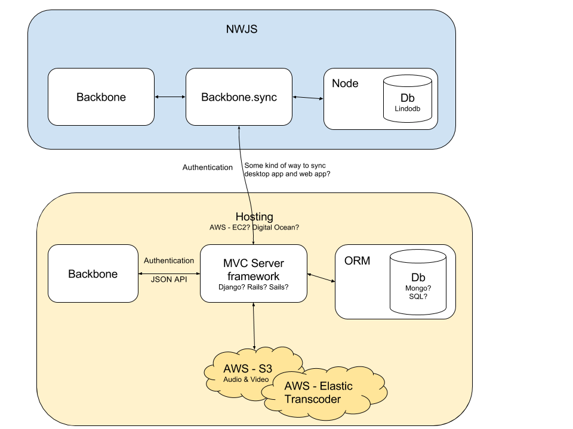

# Web app

## Architecture

Possible architecture for web app that syncs with desktop app.

autoEdit, has already been in a mobile first, responsive way. If you [check out the demo on a smartphone](https://opennewslabs.github.io/autoEdit_2/public/demo/index.html).

## Mobile friendly

autoEdit, has already been in a mobile first, responsive way. If you [check out the demo on a smartphone](https://opennewslabs.github.io/autoEdit_2/public/demo/index.html)

However there is the need to make a list of mobile friendly features in the backbone client side code that needs to be double-checked. eg make it easier to make selections.

Eg for now, you select text, and then tapping on the selection confirms it. which is not super intuitive.

Nwjs out of the box does not support mp4. However for ios compatible web app, mp4 would be preferred by safari. So that is something to work out as well.

At the moment in the demo it detects when it's on safari and uses the audio preview instead of the video. However If you try it on an android phone you'll see the video preview.

