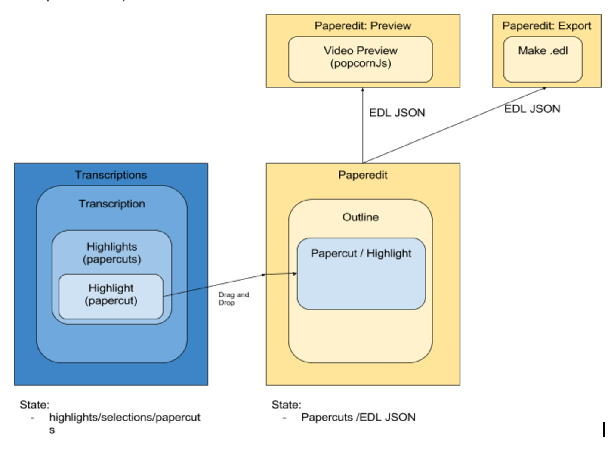

# Paper-edit

## Component/part description

### Paper-edit json schema specification

Connected to this is defining a schema for paper-edit, to make sure all components that work with this have a defined interface/specification. This is same as a spec for “EDL JSON” which is used in the EDL composer module.


* [component:Search and filter ](paper-editsearch-filter.md)
* [component:Drag and Drop papercut ](paper-editdrag-and-drop.md)
* [component:Video preview ](paper-editvideo-preview.md)

Components representation paper-edit view




Data structures in view components


## Related projects.

NA

--

## Implementations Options considered

### **Preview/ BBC Video compositor**





This is the sequence taken in by the BBC video compositor to be able to render a video preview in canvas.

It takes two tracks, but for our porpuses we can just pass one track.

Needs adding type “video”, change startTime to start.

And add duration instead of endTime.

```javascript
var playlist = {
    "tracks":[
        [{type:"image", src:"assets/aston.png", start:0, duration:10, id:"aston"}],
        [{type:"video", src:"assets/title.mp4", start:0, duration:2, id:"title"},
   {type:"video", src:"assets/title.mp4", start:2, duration:8, id:"clip1"}]
  ]
}
```


### **Hypertranscript / autoEdit Json**

This is the autoEdit json for a transcription. It models the structure of a transciptions text.

With paragraphs, lines, and words.

```javascript
"text": [
	{
	 "id": 0,
	"speaker": "Unnamed Speaker",
	"paragraph": [
			{
			  "line": [								
                      {
				"id": 0,
				"text": "oh",
				"startTime": 0.06,
                        "endTime": 1.65					                      
				},
```

### **Papercuts**

This is a papercut json extracted from the dom view.

Inside events. Contains either headings / titles or actual “papercuts” video segments.

Events is sinonimum with papercuts. In edl format they are called events.

It is missing words and text. So it’s hard to parse it back into the view once that is saved into the model/db.

→ ideally would want to change this to accomodate words, and have one papercut template for both scenarios.  


```javascript
{
	"title": "Paperedit 2",
	"events": [
		{
			"title": "Introduction",
			"id": 1
		},
		{
			"startTime": "16",
			"endTime": "22.64",
			"transcriptionId": "24dcd88b",
			"reelName": "NA",
			"clipName": "Ian Perkin-Mobile.mp4",
			"videoId": "videoId_24dcd88b",
			"speaker": "Unnamed Speaker",
			"src": "/Users/pietropassarelli/Library/Application Support/autoEdit2/media/Ian_Perkin-Mobile.mp4.1486169904445.webm",
			"audioFile": "/Users/pietropassarelli/Library/Application Support/autoEdit2/media/Ian_Perkin-Mobile.mp4.1486169904445.ogg",
			"offset": "NA",
			"id": 2
		},
```

### **Papercut in view**

Data structure used in \`papercut.html.ejs\` to make a paper-edit when selecting words in transcription side. \(hypertranscript\).

It is an array of words, and It has redundant informations. To make it easier for the extraction.

```javascript
{
    "papercut": [
        {
            "text": "but ",
            "clipName": "Ian Perkin-Mobile.mp4",
            "reelName": "NA",
            "startTime": "92.35",
            "endTime": "92.47",
            "speaker": "Unnamed Speaker",
            "audioFile": "/Users/pietropassarelli/Library/Application Support/autoEdit2/media/Ian_Perkin-Mobile.mp4.1486169904445.ogg",
            "src": "/Users/pietropassarelli/Library/Application Support/autoEdit2/media/Ian_Perkin-Mobile.mp4.1486169904445.webm",
            "transcriptionId": "24dcd88b",
            "videoId": "videoId_24dcd88b",
            "offset": "NA"
        },
        {
            "text": "it ",
            "clipName": "Ian Perkin-Mobile.mp4",
            "reelName": "NA",
            "startTime": "92.47",
            "endTime": "92.76",
            "speaker": "Unnamed Speaker",
            "audioFile": "/Users/pietropassarelli/Library/Application Support/autoEdit2/media/Ian_Perkin-Mobile.mp4.1486169904445.ogg",
            "src": "/Users/pietropassarelli/Library/Application Support/autoEdit2/media/Ian_Perkin-Mobile.mp4.1486169904445.webm",
            "transcriptionId": "24dcd88b",
            "videoId": "videoId_24dcd88b",
            "offset": "NA"
        },
   
    ]
}
```

### EJS

```javascript
<dl class="dl-horizontal">
		<dt><%= papercut[0].speaker %></dt> 
		<dt>
	  		<a data-start-time="<%= papercut[0].startTime %>" data-video-id="<%= papercut[0].videoId %>" class="timecodes"><%= fromSeconds(papercut[0].startTime) %></a>
		</dt>
		<dd>
			<% for(var i=0; i<papercut.length; i++){%>
			 	<span contenteditable="false" class="words text-muted papereditWords" 
			 	data-transcription-id="<%= papercut[i].transcriptionId %>" 
			 	data-reel-name="<%= papercut[i].reelName %>" 
			 	data-clip-name="<%= papercut[i].clipName %>" 
			 	data-video-id="<%= papercut[i].videoId %>" 
			 	data-speaker="<%= papercut[i].speaker %>" 
			 	data-src="<%= papercut[i].src %>" 
			 	data-audio-file="<%= papercut[i].audioFile %>" 
			 	data-start-time="<%= papercut[i].startTime %>" 
			 	data-text="<%= papercut[i].text %>" 
			 	data-end-time="<%= papercut[i].endTime %>"><%= papercut[i].text %> </span>
	 		<% } %>
	 	</dd>
	</dl>
```

### DB

TBC?

Needs to figure out how to save papercuts into the db in such a way that they can be extracted re-added onto the dom.

Easiest option could be sto save an array of Papercut in view json.

Where first array is a papercut

And second nested array is the words.

This would allow for reuse of the template in ejs.

For the other data structure, for now, they could be extracted and modified from the dom, kept in the state of the view, and worked on it from there.  


Ideally tho, you’d want to have the db at the centre of that diagram with other representations drawing from it to do their changes.

→ REFACTOR: look into what it takes to achive that.

### **EDL JSON/EDL export module**

At the moment as as the papercut EDL json in autoEdit but with fields less, as it doesn’t need a lot of the once in the autoEdit one, to be able to make an .edl file.

```javascript
var edlSqDemo = {
    "title": "Demo Title of project",
    //offset is optional default is "00:00:00:00"
    "events":  [
      { "id":1,
        "startTime": 10,
        "endTime": 20,
        "reelName":"SomeReelName",
        "clipName":"Something.mov"
        "offset": "00:00:28:08"
      },
      { "id":2,
        "startTime": 45,
        "endTime": 55,
        "reelName":"SomeOtherReelName",
        "clipName":"SomethingElse.mov",
        "offset": "00:00:28:08"
      },
        { "id":2,
        "startTime": 45,
        "endTime": 55,
        "reelName":"NA",
        "clipName":"SomethingElse.mov"
        "offset": "00:00:28:08"
      }
    ]
}
```


Possible solution? Altho Patchy

Add papercut with array of words with loadsof info to paperedit’s papercut obejct, see below


```javascript
{
	"title": "Paperedit 2",
	"events": [
		{
			"title": "Introduction",
			"id": 1
		},
		{
			"startTime": "16",
			"endTime": "22.64",
			"transcriptionId": "24dcd88b",
			"reelName": "NA",
			"clipName": "Ian Perkin-Mobile.mp4",
			"videoId": "videoId_24dcd88b",
			"speaker": "Unnamed Speaker",
			"src": "/Users/pietropassarelli/Library/Application Support/autoEdit2/media/Ian_Perkin-Mobile.mp4.1486169904445.webm",
			"audioFile": "/Users/pietropassarelli/Library/Application Support/autoEdit2/media/Ian_Perkin-Mobile.mp4.1486169904445.ogg",
			"offset": "NA",
			"id": 2,

			"papercut": [
	                          {
	                           "text": "but ",
	                           "clipName": "Ian Perkin-Mobile.mp4",
	                           "reelName": "NA",
	                           "startTime": "92.35",
	                           "endTime": "92.47",
	                           "speaker": "Unnamed Speaker",
	                           "audioFile": "/Users/pietropassarelli/Library/Application Support/autoEdit2/media/Ian_Perkin-Mobile.mp4.1486169904445.ogg",
	                           "src": "/Users/pietropassarelli/Library/Application Support/autoEdit2/media/Ian_Perkin-Mobile.mp4.1486169904445.webm",
	                           "transcriptionId": "24dcd88b",
	                           "videoId": "videoId_24dcd88b",
	                           "offset": "NA"
	        },
	        	...
	        ]
		},
		...
	]
}
```

Probably better approach is to

* Make a list of all places in the code where papercut and paperedit is called
  * Paparcut.htmll.ejs
  * Index.js edl module
  * Paperedit\_view.js where specifically:
    * ?

And then figure out base data structure that can work to accommodate all needs?  


## Current implementation

--

## What needs refactoring

The flow and consistency of json data representation between the different components json is not great, needs to be revisited.

For instance Paper-edit and transcription EDL export should have consistent schema. at the moment they are different.

