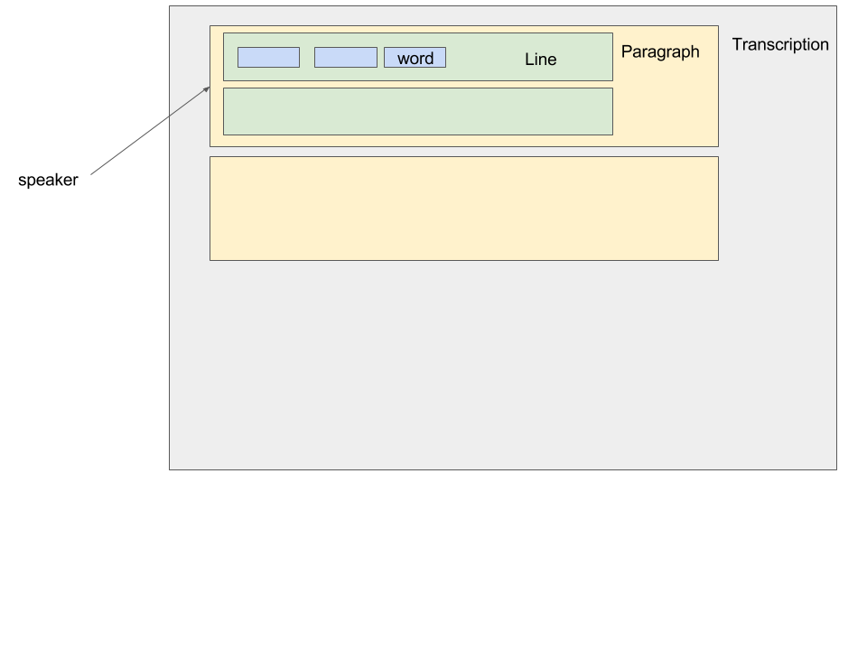

# Transcription json

## Component/part description

In this section we are looking at the Transcription JSON schema used in autoEdit.

## Related projects.

Connected to this is defining a schema for transcription, to make sure all components that work with this have a defined interface/specification. Eg [BBC Transcript model](https://github.com/bbc/transcript-model)

### Gentle - json

[See appendix for json](../appendix-data-structures/gentle-json-transcription-specs.md) example.

### IBM - Json

[See appendix for json](../appendix-data-structures/ibm-watson-json-specs.md) example. As well as their [stt api reference](https://www.ibm.com/watson/developercloud/speech-to-text/api/v1/) and documentation.

### Pocketsphinx  - plain text

[See appendix for example](../appendix-data-structures/pocketsphinx-results.md) pocketsphinx plain text.

## Implementations Options considered

### Other

An array of words object, to represent lines this could also be a nested array of word objects.

Where the word object at a minimum as a start, end time and text attribute.

## Current implementation

### Transcription domain

autoEdit JSON Transcription schema at a high level it models the objects present in a transcription.

In this representation:

* Transcription 
  * Paragraphs  ← speaker 
    * Lines 
      * Words 

Speakers are associated to paragraphs. Paragraphs are treated as sections of lines.

A list of speakers can also be kept separate, similarly to how IBM Watson stt API returns the results of speaker diarization.

[See Appendix for autoEdit json schema example](../appendix-data-structures/autoedit-transcription-json.md).

## What needs refactoring

Name of `paragraph` and `line` attribute are ambiguos. It should be `lines` and `words` instead\(?\).

### replace array with hash

This is a bigger refactoring but instead of array data structure, could use hash/dictionary.

This way id is the key. and can make use of `key` `value` methods available in js. Lookup speed would improve\(?\) and could easily get array of values using js method. 

